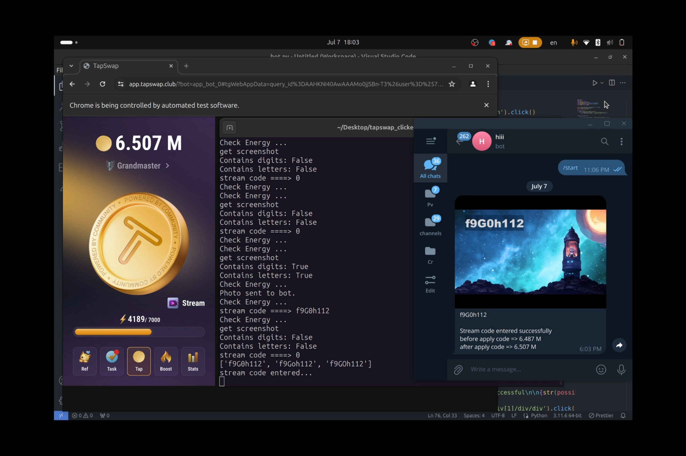

# tapswap_tapper

tapswap bot for auto click and bypass stream codes



## Install & Run

### Prerequisites
1. Install Python 3.
2. Install necessary libraries from `requirements.txt`.
3. Install google chome and setup selenium driver
4. tesseract-ocr
5. ffmpeg

### Steps

1. **Install Python 3**  
   Ensure that you have Python 3 installed on your system. You can download and install it from the official Python website: [Python Downloads](https://www.python.org/downloads/).

2. **Install Libraries from `requirements.txt`**  
   Open your terminal and navigate to the project directory. Run the following command to install the required libraries:
   ```sh
   pip3 install -r requirements.txt


3. **Install tesseract & ffmpeg in Debian (ubuntu)**
   ```sh
   sudo apt-get update
   sudo apt-get install tesseract-ocr
   sudo apt-get install ffmpeg

3. **Install tesseract in Debian (ubuntu)**
   ```sh
   sudo apt-get update
   sudo apt-get install tesseract-ocr


4. **Edit the Configuration File**
   - Open the `config.json` file and edit the necessary parameters.
   - Example `config.json`:
   - Get api key from [OCR](https://ocr.space)
     ```json
      {
         "url": "",
         "limit": 7000,
         "multitap_level": 9,
         "bot_token": "5355443512:AAFH1UigfirhfkwruhfowirufhoQ7Pw",
         "chat_id": 1979953056,
         "ocr_api_key": "Kiweygfieyiwe88957"
      }


5. **Install and setup google chrome driver**

6. **run**
   ```python
   python3 bot.py